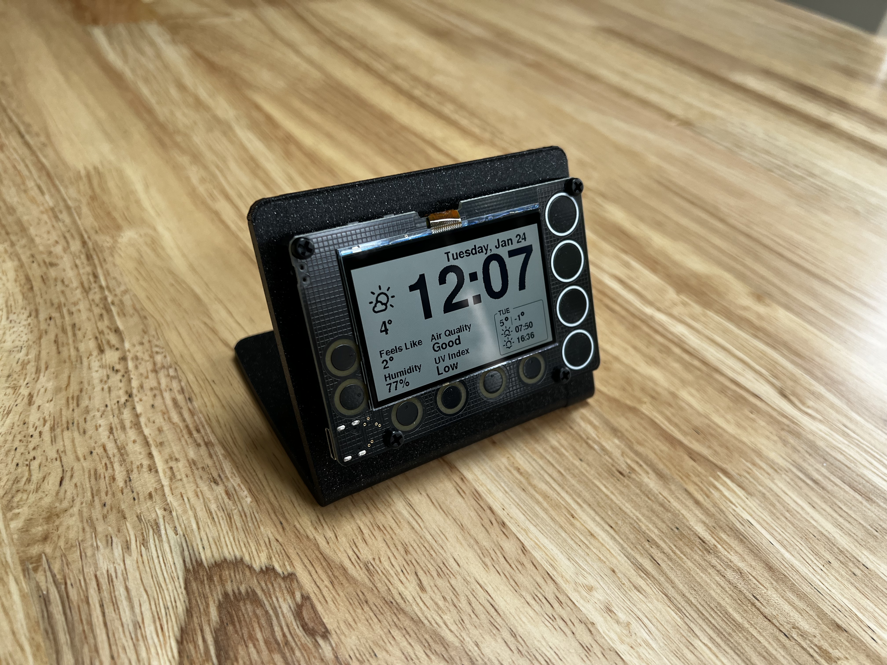

# Newt_3dPrint_Case

Case for Newt Display https://github.com/Phambili-Tech/Newt_Display.

## Printing

Grab the [STL](newt_holder.stl) and print with the following settings:

- 0.2mm Layer height
- 20% infill
- Print it on it's side, so no supports needed

## Assembly

In the pictures above 4x 8mm M3 Spacers and 4x M3 Bolts were used. The stand prints abotu 5mm thick, so the bolt end of the spacer
will need to be 7-8mm long if you want to use a nut to attach it. I didn't hve any spacers that size so just hot glued in the spacer in.
A recess for a bolt could probably be added in a future version (feel free to submit a PR).
